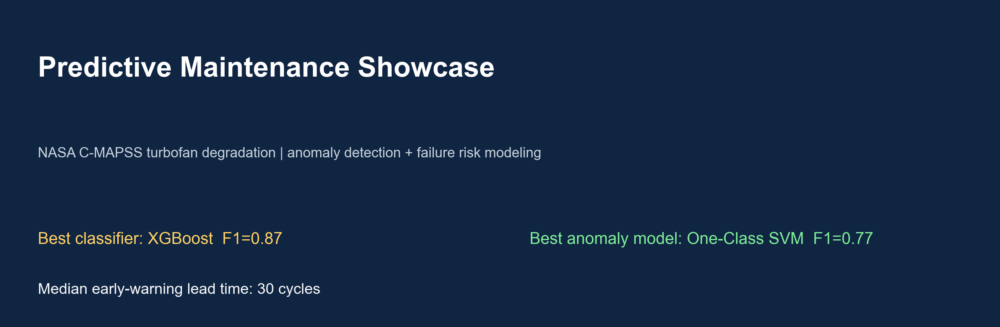
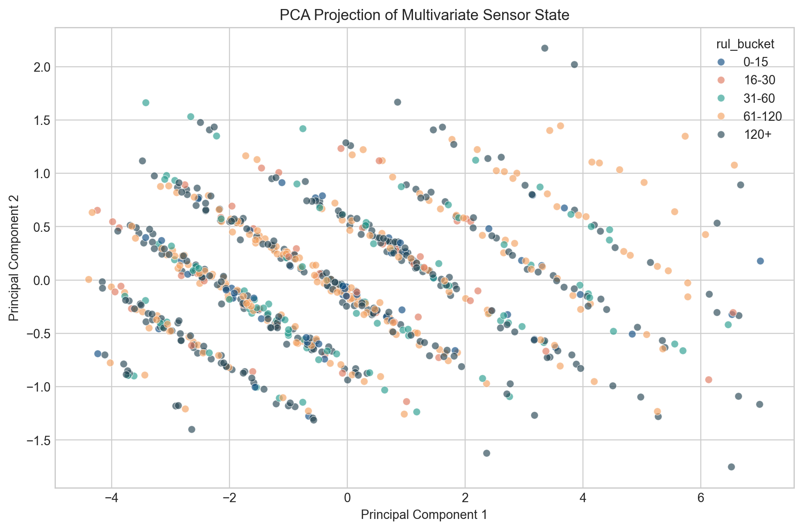
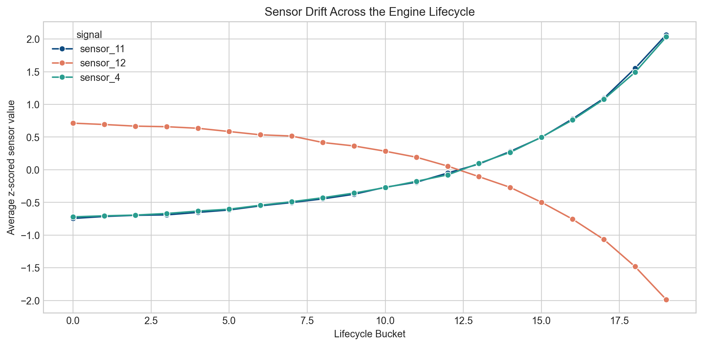
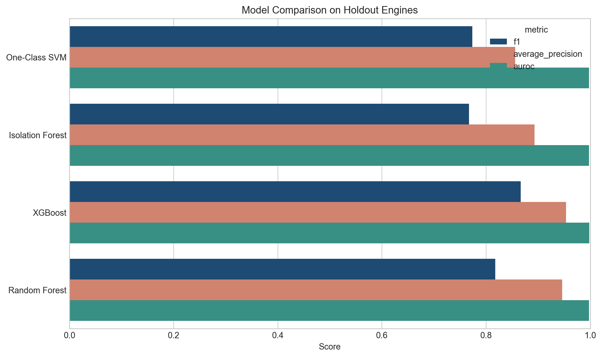
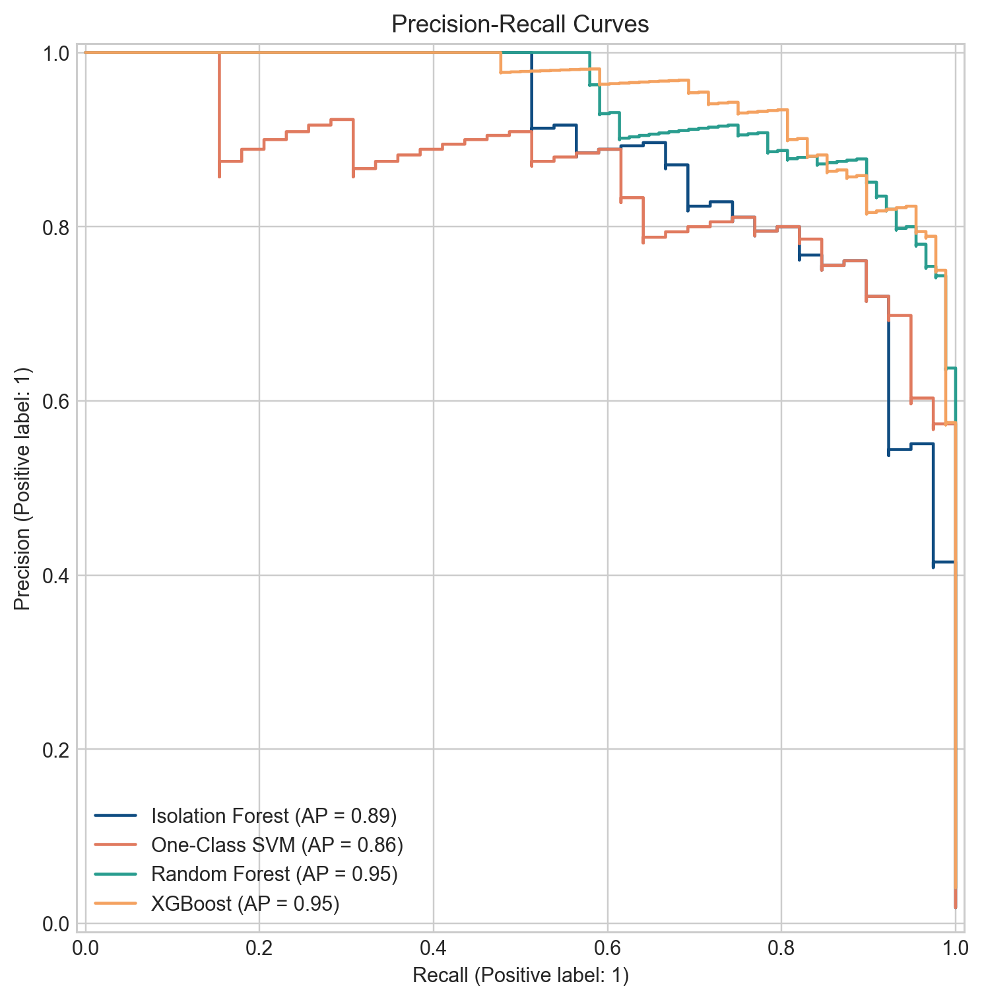
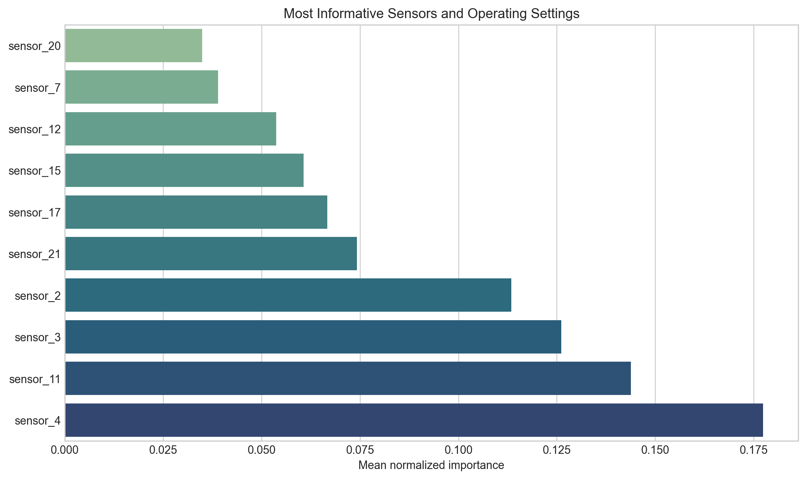
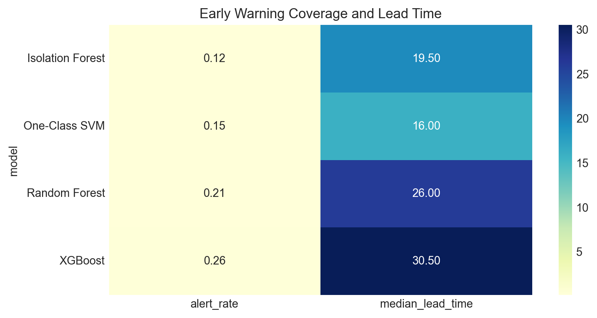
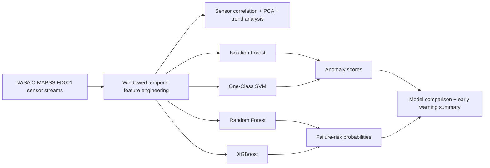

# Predictive Maintenance and Anomaly Detection




This project builds an early-warning system for industrial equipment using multivariate sensor streams from the NASA C-MAPSS turbofan degradation benchmark. It combines unsupervised anomaly detection with supervised failure-risk prediction, adds interpretability through sensor ranking and feature importance, and finishes with an operations-friendly reporting layer.

## Why do this project at all?

- To show Work on real sequential sensor data instead of toy tabular data.
- Compares anomaly detection and predictive maintenance approaches in the same workflow.
- Uses temporal feature engineering, multivariate analysis, model comparison, and explainability.
- Produces visual artifacts and reports that feel closer to production analytics than a notebook-only experiment.

## Project snapshot

| Area | Best result |
| --- | --- |
| Failure classification | XGBoost, F1 `0.87`, AP `0.95`, AUROC `1.00` |
| Anomaly detection | One-Class SVM, F1 `0.77`, AP `0.86`, AUROC `1.00` |
| Median early warning lead time | `30 cycles` before the 30-cycle failure horizon |
| Most informative signals | `sensor_4`, `sensor_11`, `sensor_3`, `sensor_2`, `sensor_21` |

## Visual walkthrough

### 1. Multivariate sensor state separates healthy and failing regimes


### 2. The most important sensors show visible drift through the lifecycle


### 3. Supervised and unsupervised models can be compared on the same holdout set


### 4. Precision-recall curves make the alert tradeoff explicit


### 5. Interpretability helps explain why an alert fired


### 6. Early-warning coverage is summarized in an operator-friendly view


## Method



### What the pipeline does

1. Downloads the NASA FD001 turbofan run-to-failure dataset automatically.
2. Converts raw telemetry into sliding temporal windows.
3. Engineers summary, variability, and trend features for every signal.
4. Trains anomaly detectors on healthy windows.
5. Trains supervised models to predict whether failure is within 30 cycles.
6. Compares precision, recall, F1, average precision, and AUROC.
7. Aggregates signal importance and writes an early-warning summary report.

## Repo guide

| Path | Purpose |
| --- | --- |
| `src/predictive_maintenance/` | Reusable pipeline code for data prep, modeling, and reporting |
| `scripts/run_pipeline.py` | End-to-end runner that regenerates artifacts |
| `scripts/build_notebook.py` | Builds the showcase notebook from generated outputs |
| `notebooks/predictive_maintenance_analysis.ipynb` | Narrative notebook for walkthroughs and demos |
| `reports/early_warning_summary.md` | Short operations-facing summary |
| `reports/figures/` | Graphics used in this README and notebook |
| `data/processed/` | Saved metrics, rankings, and preview outputs |

## How to run

### 1. Create the environment

```powershell
py -3.13 -m venv .venv
.venv\Scripts\python.exe -m pip install -r requirements.txt
```

### 2. Run the full pipeline

```powershell
.venv\Scripts\python.exe scripts\run_pipeline.py
```

This command:

- downloads the FD001 dataset if it is missing
- trains all four models
- writes metrics into `data/processed/`
- saves all charts into `reports/figures/`
- generates the early-warning markdown report

### 3. Rebuild the notebook artifact

```powershell
.venv\Scripts\python.exe scripts\build_notebook.py
```

## Deliverables included

- `sensor analysis notebook`
- `anomaly detection pipeline`
- `classification and prediction comparison`
- `sensor importance plots`
- `early-warning summary report`


## Dataset

- Source: NASA C-MAPSS FD001 turbofan engine degradation benchmark
- Accessed through a public GitHub mirror for reproducible downloads inside the pipeline

